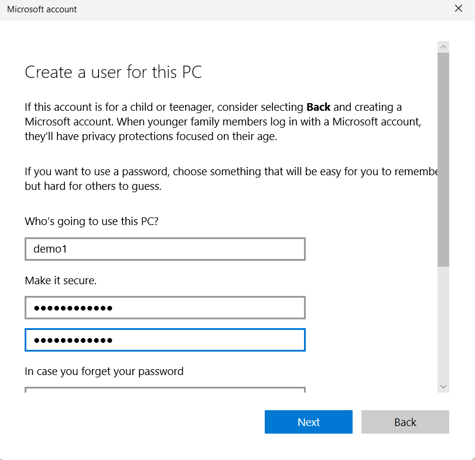

Project Title

# Windows 10 User Account Management 

## Overview

This project demonstrates **User Account Management tasks** in Windows 10. It includes step-by-step instructions, screenshots, and notes.

## Tasks Covered

1. Create a new user account
2. Reset a user account password
3. Change a user account password
4. Delete a user account

## Step-by-Step Instructions

### 1. Create a New User Account
- Settings → Accounts → Family & other users → Add someone else  
- Enter username & password  

### 2. Reset a User Account Password
- Settings → Accounts → Sign-in options → Password → Change  
- Or as Admin: Computer Management → Local Users and Groups → Users → Set Password  

### 3. Change User Account Password
- Press Ctrl + Alt + Delete → Change a password → Enter old & new passwords  

### 4. Delete a User Account
- Settings → Accounts → Family & other users → Select user → Remove → Delete account and data  

## Screenshots
 

## Conclusion
This project helps understand basic user account management in Windows 10, an important skill for IT support.
